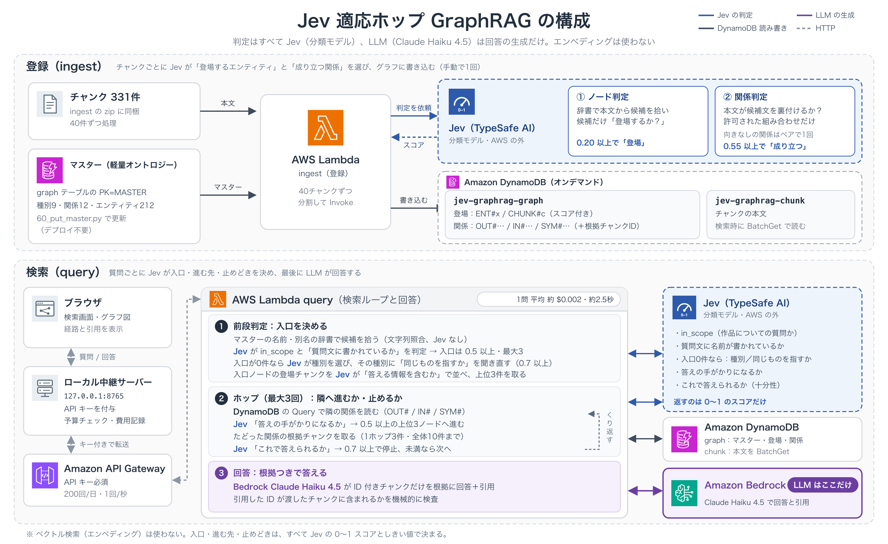

# Jev GraphRAG PoC

エンベディングを使わない、判断特化型のGraphRAGの検証用実装です。

- グラフの登録(どのエンティティが登場するか・どの関係が成り立つか)と、検索中の判断(入口・進む先・止めどき)は、すべてJev(TypeSafe AI System One)の0〜1のスコアとしきい値で決めます
- LLM(Amazon BedrockのClaude Haiku 4.5)は、最後の回答の生成だけに使います
- ベクトル検索・エンベディングは使いません。入口はマスター(軽量オントロジー)の名前・別名の辞書で拾います

## 構成図



## しくみ

### 登録(ingest)

1. マスター(ノード種別・関係の種類・エンティティ)をDynamoDBに入れる
2. チャンクごとに、辞書で本文からエンティティの候補を拾い、Jevに「このチャンクに登場するか」を判定させる(0.20以上で登場)
3. 登場したエンティティの組み合わせ × 許可された関係で候補文を作り、Jevに「本文が裏付けるか」を判定させる(0.55以上で成立)
4. 登場・関係を、根拠のチャンクID付きでDynamoDBのgraphテーブルに書く

### 検索(query)

1. 前段判定: 辞書で質問文から候補を拾い、Jevに「質問文に書かれているか」を聞いて入口を決める(0件なら種別を選ばせて聞き直す)
2. ホップ0: 入口の登場チャンクを、Jevの「質問に答える情報を含むか」のスコア順に取る
3. ホップn: 隣の関係の候補文ごとにJevに「答えの手がかりになるか」を聞き、上位の隣へ進んで、たどった関係の根拠チャンクを足す
4. 十分性: 集めたチャンクでJevに「これで答えられるか」を聞き、0.7以上なら止める(adaptiveモード)
5. 回答: Haikuに集めたチャンクだけを渡し、根拠チャンクID付きのJSONで答えさせ、引用を機械的に検査する

モードは`fixed1`(1ホップ固定)・`fixed2`(2ホップ固定)・`adaptive`(十分性で止める。最大3ホップ)の3つです。

## フォルダ構成

| パス | 内容 |
|---|---|
| `lib/` | 登録・検索の本体と共通部品(Lambdaのzipにも入る) |
| `lambdas/ingest/`・`lambdas/query/` | Lambdaの入口 |
| `infra/` | zipの作成(`build.sh`)・APIキーの登録と状態確認(`deploy.py`)・IAMポリシーのひな形 |
| `infra/cdk/` | AWSリソース一式のCDK(Python)アプリ |
| `scripts/` | 疎通確認・マスター投入・登録・検索・評価のスクリプト |
| `ui/` | 検索画面とローカル中継サーバー |
| `data/` | サンプルデータ(マスター・チャンク・質問) |

## 前提

- AWSアカウント(東京リージョンap-northeast-1を前提)と、IAMロール・DynamoDB・Lambda・SSM・API Gatewayを作れる権限
- Amazon BedrockでClaude Haiku 4.5(推論プロファイル`global.anthropic.claude-haiku-4-5-20251001-v1:0`)のモデルアクセスが有効になっていること
- Jev(TypeSafe AI)のAPIキー
- Python 3.13以上(Lambdaのランタイムはpython3.13 / arm64)
- `zip`と`file`コマンド(`infra/build.sh`が使います)
- Node.js(22か24を推奨。CDK CLIを`npx aws-cdk@2`で使うため。グローバルインストールは不要)。検索画面はブラウザだけで動きます

## セットアップ

```bash
python3 -m venv .venv
./.venv/bin/pip install -r requirements.txt

# Jev の API キー(.env は git に入れない)
echo 'apikey=<Jev の API キー>' > .env
chmod 600 .env

# AWS を触るスクリプトは、このアカウント ID と一致しないと止まる
export JEV_AWS_ACCOUNT_ID=<12 桁のアカウント ID>
export AWS_PROFILE=<使うプロファイル>        # 必要なら

# Jev の疎通確認(1 リクエスト)
./.venv/bin/python scripts/00_smoke_jev.py
```

## デプロイ

AWSリソース(DynamoDBテーブル2本・Lambda 2つ・ロググループ・IAMロール・API Gateway・APIキー・使用量プラン)は、`infra/cdk/`のCDKアプリでまとめて作ります。JevのAPIキー(SSM SecureString)だけはスタックに入れず、`deploy.py put-secret`で別に登録します。

### 1. JevのAPIキーを登録

```bash
./.venv/bin/python infra/deploy.py put-secret      # .env の API キーを SSM SecureString に登録(東京)
```

### 2. Lambdaのzipを作る

```bash
bash infra/build.sh                                # build/ingest.zip・build/query.zip
```

CDKはこのzipをそのまま使います(CDK側でバンドルし直しません)。

### 3. CDKでデプロイ

```bash
cd infra/cdk
python3 -m venv .venv                              # リポジトリ直下の .venv とは別
./.venv/bin/pip install -r requirements-cdk.txt

npx aws-cdk@2 synth                                # テンプレートの確認だけ(AWS は呼ばない)
./.venv/bin/python check_parity.py --template cdk.out/JevGraphragPoc.template.json   # 設定の突き合わせ
npx aws-cdk@2 bootstrap aws://$JEV_AWS_ACCOUNT_ID/ap-northeast-1   # 最初の 1 回だけ
npx aws-cdk@2 deploy                               # スタック JevGraphragPoc
cd ../..
```

- アカウントは環境変数`JEV_AWS_ACCOUNT_ID`で指定します。認証情報のアカウントと違うと止まります。`synth`だけならダミーの12桁でも動きます
- IAMロールの権限は`infra/iam/policy.json`と同じです(`check_parity.py`で突き合わせます)
- `cdk bootstrap`は、CDKがデプロイに使うIAMロールやS3バケット(スタック`CDKToolkit`)を作ります。既定ではCloudFormationの実行ロールに`AdministratorAccess`が付くので、気になる場合は`--cloudformation-execution-policies`で絞ってください
- Node.js 25などで出るjsiiの警告は`JSII_SILENCE_WARNING_UNTESTED_NODE_VERSION=1`で消せます

### 4. URLとAPIキーをローカルに書く(検索画面から使う場合)

```bash
./.venv/bin/python infra/cdk/write_api_local.py    # スタックの出力から URL とキー ID を読み、キーの値を取って書く
```

URLとAPIキーは`.api.local.json`(権限600。gitに入れない)に書かれます。キーの値は表示しません。APIキー必須・使用量プランで1回/秒・200回/日に絞っています。

### 5. マスターの投入と登録

```bash
./.venv/bin/python scripts/60_put_master.py --file data/master_v3.json
./.venv/bin/python scripts/20_invoke_ingest.py --dry-estimate   # 見積もりだけ(AWS に触れない)
./.venv/bin/python scripts/20_invoke_ingest.py --reset          # 40 チャンクずつ ingest Lambda を呼ぶ
```

### 6. 状態の確認

```bash
./.venv/bin/python infra/deploy.py status       # 作ったものの一覧(読むだけ)
```

CDKで作ったリソースも名前で見つけて表示します。ただしLambdaの呼び出し許可はCDKが別のIDで付けるので、`status`では「無し」と出ます(実際の許可はスタック内にあります)。

### deploy.py だけで作る場合(旧手順)

`infra/deploy.py`の`create-tables`・`deploy-lambdas`・`create-api`と、`infra/iam/`を使った手作業のIAMロールでも同じ構成を作れます。リソース名が同じなので、**CDKのスタックと同じアカウントで混ぜて使わないでください**(名前がぶつかって作成に失敗するか、`teardown`がスタックの中身を外から消してしまいます)。

## 使い方

### 単発の検索

```bash
./.venv/bin/python scripts/21_invoke_query.py --qid q03                 # 3 モードで実行
./.venv/bin/python scripts/21_invoke_query.py --question "ルフィの祖父は誰か？" --modes adaptive
```

`--qid`で使えるのは`data/questions_v2.json`のq01〜q05です。ほかの質問は`--question`で文を渡します。

入口・ホップごとの判断・集めたチャンク・回答・引用の検査結果・レイテンシ・費用を表示し、`results/query/`に保存します。

### 評価

```bash
./.venv/bin/python scripts/30_run_eval.py --run-name dev1                # 質問 × 3 モード
./.venv/bin/python scripts/30_run_eval.py --run-name dev1 --closed-book  # チャンクなしで Haiku に聞く(比較用)
./.venv/bin/python scripts/31_make_review_sheet.py --run dev1            # 目視採点シート results/eval/dev1/review.md
./.venv/bin/python scripts/32_summarize.py --run dev1                    # 集計 results/eval/dev1/summary.md
```

質問ファイルは環境変数`JEV_QUESTIONS`で切り替えます(既定`data/questions_v2.json`)。

```bash
JEV_QUESTIONS=data/questions_test_v2.json ./.venv/bin/python scripts/30_run_eval.py --run-name test1
```

### 検索画面

```bash
./.venv/bin/python ui/server.py          # http://127.0.0.1:8765
./.venv/bin/python ui/server.py --demo   # API を呼ばず、results/query/ に保存した結果を表示
```

中継サーバーは`127.0.0.1`だけで待ち受け、APIキーをブラウザに渡さずにAPI Gatewayへ転送します。画面には、入口からホップしていく経路をグラフ図で表示します。

## サンプルデータ

| ファイル | 内容 |
|---|---|
| `data/chunks_v2.json` | 3作品(ONE PIECE・名探偵コナン・名探偵プリキュア!)についての短い説明文331チャンク |
| `data/master_v3.json` | マスター。ノード種別9・関係12・エンティティ212 |
| `data/questions_v2.json` | 開発用の質問(5問) |
| `data/questions_test_v2.json` | テスト用の質問(20問) |
| `data/questions_blind_v1.json` | 追加の評価用の質問(10問) |

チャンクはこのPoCのために独自に書いた説明文です。作品名・キャラクター名などは各権利者に帰属します。

データは`JEV_DATASET`(既定`v3`)で選び、`data/master_<版>.json`と`data/chunks_<版>.json`の組で読みます(v3のチャンクは`chunks_v2.json`)。

## 費用の目安

実測値です。料金は変わることがあるので、各サービスの料金ページで確認してください。

| 処理 | 費用 |
|---|---|
| 登録(331チャンク、Jevのみ) | 約$0.035 |
| 検索1問(Jev + Haiku) | 約$0.002 |

このほかDynamoDB(オンデマンド)・Lambda・API Gateway・SSMの料金がかかります。スクリプトは実行前に見積もりを表示し、`results/cache/`に残した呼び出し記録の累計が$9を超えそうなら止まります(`lib/common.py`の`BUDGET_LIMIT_USD`)。

## 後片付け

```bash
cd infra/cdk && npx aws-cdk@2 destroy && cd ../..   # スタックの中身(テーブルも)を削除。IAM ロールもスタックと一緒に消える
./.venv/bin/python infra/deploy.py teardown          # 残った SSM パラメータと .api.local.json を削除(yes で確認)
```

- `deploy.py teardown`は、必ず`cdk destroy`の**後**に実行してください(先に実行すると、スタックが管理しているリソースを外から消してしまいます)
- `cdk bootstrap`で作ったスタック`CDKToolkit`は残ります。不要ならCloudFormationから削除してください(S3バケットはスタックを消しても残るので、空にしてから手動で削除)

## 注意

- JevはAWSの外のサービスです。登録ではチャンク本文を、検索では質問文とチャンク本文をJevのAPIに送ります。機密情報を含むデータで試す前に、TypeSafe AIの利用規約とデータの扱いを確認してください
- 検証用の実装です。本番での利用は想定していません
- API GatewayはAPIキー必須・使用量プランで1回/秒・200回/日に絞っています
- 使わなくなったら後片付けをしてください(DynamoDB・SSMなどは残しておくと料金がかかります)

## ライセンス

[MIT](LICENSE)
